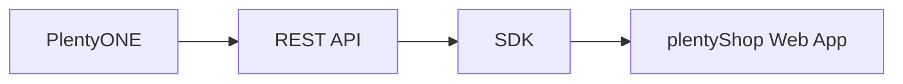

# Contributing

Thank you for contributing to plentymarkets/plentyshop-pwa! To smoothen everyone's experience involved with the project, please take note of the following guidelines and rules.

## Contribution guidelines

We welcome contributions from the community. Please follow these guidelines when contributing:

1. Fork the repository.
2. Create a new branch for your changes.
3. Run `npm run format` to check for formatting errors. `npm run format:fix` resolves a subset of errors automatically.
4. Run `npm run lint` to check for linting errors. `npm run lint:fix` resolves a subset of errors automatically.
5. Make your changes and commit them. Commit messages have to follow the [Conventional Commit specification](https://www.conventionalcommits.org/en/v1.0.0/). Allowed types: `build`, `chore`, `ci`, `docs`, `feat`, `fix`, `perf`, `refactor`, `revert`, `style`, `test`.
6. Push your changes to your fork.
7. Open a pull request from your branch to the main repository's `main` branch. Take care to open the pull request against the plentymarkets repository, not the Alokai repository upstream.
8. Create a draft pull request and make sure all checks pass before requesting a review.
9. Once approved, the pull request will be merged into the `main` branch.

## Coding rules

To keep the code base of plentymarkets/plentyshop-pwa neat and tidy, the following rules apply to every change:

### Automated checks

- The change passes all new and existing tests.
- The change doesn't contain lint errors.
- If the change introduces lint warnings, please describe why you believe it's the best solution regardless.

### Presentation

- If possible, use existing [Storefront UI 2 components](https://docs.storefrontui.io/v2/vue/components.html) instead of creating new components.
- If no Storefront UI component fits the requirements, create new components in `apps/web/app/components`.
- Use [Tailwind classes](https://v2.tailwindcss.com/docs) instead of SCSS. For additional variables, refer to the [Tailwind configuration](/apps/web/app/configuration/tailwind.config.ts).

### Logic

The data between PlentyONE and the web app flows as follows:

Logical operations should take place as far upstream as possible. This means most operations should happen in the back end or SDK. The web app should only access computed data via the SDK's getters. The web app itself is restricted to the following operations:

- [State management](https://nuxt.com/docs/getting-started/state-management)
- Direct browser interactions

Both types of operations should take place in composables.

Components shouldn't contain any logic, they're strictly for presentation. Components may still access nested data directly.
