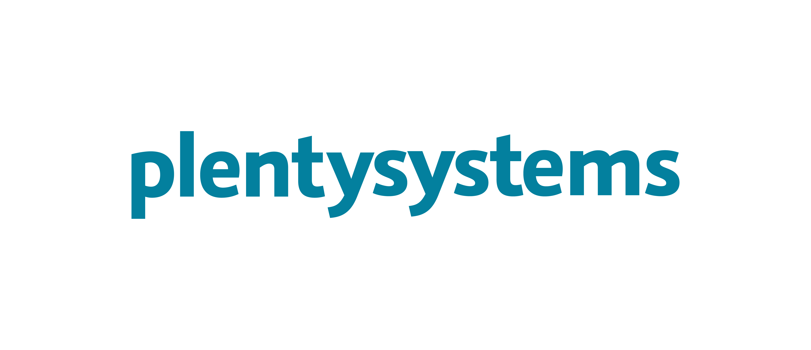

  

  

  <h1 align="center">Vue Storefront 3 Integration With plentysystems</h1>

Welcome to the plentysystems integration for Vue Storefront 3. For a technical overview of the repository structure, refer to the [Guide](GUIDE.md). The rest of the README details how to configure your plentysystems system and get started with the project.

## plentysystems system setup

To run this project, you need a plentysystems system. Get a free 30-day trial [on our website](https://www.plentymarkets.com/) or choose one of the [available editions](https://www.plentymarkets.com/product/pricing/).

### Plugins

> :bulb: New systems ship with the required plugins pre-installed. If you use a new system, skip to the next step.

For plentyShop PWA to run, you have to install plugins that provide additional REST routes and providers. Carry out the following steps:

1. Log into your plentysystems system.
2. [Install](https://knowledge.plentymarkets.com/en-gb/manual/main/plugins/installing-added-plugins.html#installing-plugins) the following plugins in the latest version:
    - IO
    - plentyShop LTS
    - PayPal
    - Cash in advance
    - Pay upon pickup
    - DHL Shipping (Versenden)
    - Customer feedback
3. Set the priorities of the plugins, so that IO has the highest priority and plentyShop LTS the second highest. The priorities of all other plugins remains 0.

### System configuration

1. Log into your plentysystems system.
2. Go to **Setup » Guided Tours** and complete **Setting up plentyShop**.
3. *Optional:* Go to **Setup » Orders » Payment » PayPal** and set up your PayPal account. If you skip this step, remove the PayPal component from the app.

## Local dev setup

This section describes how to run the project locally.

### Prerequisites

- `Node.js` 20+
- `Yarn` 3

Download Node.js from the [official website](https://nodejs.org/) or use [nvm](https://github.com/nvm-sh/nvm) to switch to a compatible version. For installation instructions for Yarn, refer to the [Yarn documentation](https://yarnpkg.com/getting-started/install).

### Repository fork

We recommend working with a fork of this repository. A fork allows you to easily incorporate updates from this boilerplate into your own codebase.

1. [Create a fork](https://docs.github.com/en/get-started/quickstart/fork-a-repo).
2. [Clone the forked repository](https://docs.github.com/en/repositories/creating-and-managing-repositories/cloning-a-repository).

### Configuration

- Open [`middleware.config.ts`](./apps/server/middleware.config.ts) and replace `url` with the URL of your plentysystems system.
- Open [`i18n.config.ts`](./apps/web/i18n.config.ts) and [`nuxt.config.ts`](./apps/web/nuxt.config.ts) to update the locales. The locale settings have to match the plentysystems system settings. The `fallbackLocale` and `defaultLocale` have to match the system default language.
- Open [`nuxt.config.ts`](./apps/web/nuxt.config.ts) to manage your `pwa.workbox` settings. [Workbox](https://developer.chrome.com/docs/workbox/) provides libraries and tools for Progressive Web App functionality.
- Open [`tailwind.config.ts`](./apps/web/tailwind.config.ts) to update your theme.
- Open [`cookie.config.ts`](./apps/web/cookie.config.ts) to manage your consent cookies.

### Starting the app

1. Open the repository in your command line interface.
2. Run `yarn` to install all dependencies.
3. Run `yarn dev` to start the development server. The app will be served with hot reload at [localhost:3000](http://localhost:3000/).

## Deployment

This section describes how to deploy your app on your live domain.

### plentysystems system

1. Log into your plentysystems system.
2. Go to **CMS » Deployment**.
3. Click on :plus: to add a new application.
4. Fill in the required information.
5. **Create** the application.

Copy the **Access key** to your clipboard. You'll need it in the next part.

### GitHub

1. In your forked repository, [create 2 encrypted secrets](https://docs.github.com/en/actions/security-guides/encrypted-secrets#creating-encrypted-secrets-for-a-repository):

    - `URL_ENDPOINT`: TODO
    - `URL_ENDPOINT_TOKEN`: The **Access key** from the previous part.

2. In your forked repository, enable the GitHub Action `Add zip file to S3 bucket` from `upload.yml`. Update the trigger conditions to determine when to upload your repository to your plentysystems system.

## Resources

### Features

- [Turborepo](https://turbo.build/) remote cache build system, with blazingly fast execution of commands (build, lint, test etc.) on your local machine.
- [TypeScript](https://www.typescriptlang.org/) support.
- [Nuxt.js 3](https://nuxt.com/) & Server Side Rendering for great UX, loading and SEO scores.
- Beautiful components built with [TailwindCSS](https://tailwindcss.com/) and [Storefront UI](https://docs.storefrontui.io/v2/) - a lightweight, accessible, and customizable component library built for e-commerce.
- Unit tests with [Vitest](https://vitest.dev/) and [Vue Test Utils](https://test-utils.vuejs.org).
- [ESLint](https://eslint.org/) for code linting.
- [Prettier](https://prettier.io/) code formatter.
- [Husky](https://typicode.github.io/husky/) for working with Git hooks efficiently.
- [Conventional Commits](https://www.conventionalcommits.org/en/v1.0.0/) standard for commit messages.
- Staged code linting with [lint-staged](https://github.com/okonet/lint-staged).
- [Progressive Web App](https://developer.mozilla.org/en-US/docs/Web/Progressive_web_apps/Guides/What_is_a_progressive_web_app) features with [Vite PWA for Nuxt](https://vite-pwa-org.netlify.app/).
- `i18n` localisation powered by [Nuxt-i18n](https://i18n.nuxtjs.org).
- [Vue Storefront SDK](https://docs.vuestorefront.io/sdk/) ready - integrate headless E-commerce platform with your project easily.
- [Vue Storefront Middleware](https://docs.vuestorefront.io/v2/architecture/server-middleware.html).
- Maximized lighthouse score.

### Vue Storefront

- [Introduction to learn what is Vue Storefront](https://docs.vuestorefront.io/v2/getting-started/introduction.html).
- [Vue Storefront Documentation](https://docs.vuestorefront.io/v2/)
- [Vue Storefront UI Documentation](https://docs.storefrontui.io/v2/vue/getting-started.html)
- [Community Chat](http://discord.vuestorefront.io)

## License

Distributed under the MIT License. See [LICENSE](LICENSE.md) for more information.

## Contributing

Please see our [contributing.md](contributing.md) for more information.

## Support

If you have any questions about this integration we will be happy to answer them on the `plentymarkets` channel of the [Vue Storefront Discord](http://discord.vuestorefront.io).
