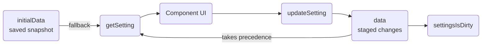
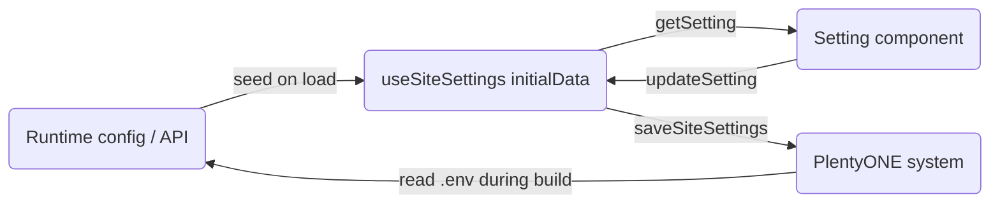

# Site settings architecture

This article explains how the editor's settings drawer discovers, renders, and persists site settings in PlentyONE Shop. It covers the folder-layout convention that drives automatic component discovery, the role of each required wrapper file, the two composables that manage state and persistence, and how Nuxt modules and customer packages can extend or override settings without touching core code.

The settings drawer is a sidebar panel in the editor where merchants configure storefront-wide values such as colours, fonts, and layout parameters. Settings are organised into a three-level hierarchy: **main categories** (each with its own toolbar button), **sub-categories** (intermediate sections within a category), and **groups** (labelled clusters of related individual settings). Each level maps directly to a folder in the filesystem. Discovery is automatic — no manual registration is required beyond placing files at the correct path.

|                                                              |                                            |
| ------------------------------------------------------------ | ------------------------------------------ |
|  |  |

## Background

The folder convention was designed to allow core code, Nuxt modules, and customer packages to all contribute settings through a single, predictable mechanism without any of them needing to know about each other. Previously, every new settings panel had to be manually registered in `SiteConfigurationDrawer.vue` and `SettingsToolbar.vue`. The convention replaces that with a file-system contract: put files in the right place and they appear automatically.

## Folder layout

The full path for a setting component follows this pattern:

```
components/settings/<mainCategory>/<subCategory>/<group>/<Setting>.vue
```

A complete example for the branding and design category looks like this:

```
components/
└─ settings/
   └─ branding-and-design/           # main category (one toolbar button)
      ├─ ToolbarTrigger.vue          # toolbar button component
      ├─ View.vue                    # main category wrapper
      ├─ lang.json                   # display name translations
      └─ design/                     # sub-category
         ├─ View.vue                 # sub-category wrapper
         ├─ lang.json
         └─ 2.colours/              # group (numeric prefix controls order)
            ├─ PrimaryColour.vue    # individual setting
            └─ SecondaryColour.vue
```

> [!NOTE]
> A folder only appears in the drawer if it contains at least one valid individual setting component.

### `ToolbarTrigger.vue`

`ToolbarTrigger.vue` is placed at the root of the main category folder. It defines the button that appears in the editor's left sidebar. The framework passes an `active` prop indicating whether this category is currently open, which the component uses to toggle its visual state.

### `View.vue`

A `View.vue` is required at both the main category level and each sub-category level. It is a wrapper component responsible for rendering the section title and any description text. The `SiteConfigurationView` component handles the consistent layout around it.

### `lang.json`

`lang.json` is optional but recommended. It provides human-readable display names for the folder names that appear as labels in the drawer navigation. Place one at any folder level where the raw folder name would otherwise be shown.

```json
{
  "branding-and-design": "Branding & Design"
}
```

## State management

Two composables divide responsibility for settings state.

**`useSiteSettings(key)`** manages the key/value store for individual setting values. Individual setting components call it with their key to get `getSetting` and `updateSetting`. Staged changes (edits the merchant has made but not yet saved) are held in `data`. The last saved snapshot is held in `initialData`, which is seeded from `useRuntimeConfig().public` on initialisation and updated from the PlentyONE API when the page loads.



The full API exposed by `useSiteSettings`:

| Member                     | Type                     | Description                                                                                                       |
| -------------------------- | ------------------------ | ----------------------------------------------------------------------------------------------------------------- |
| `getSetting()`             | `() => string`           | Returns the staged value if present, otherwise the saved value.                                                   |
| `updateSetting(value)`     | `(string) => void`       | Stages a new value locally without saving.                                                                        |
| `getJsonSetting()`         | `() => string[]`         | Like `getSetting`, but parses the value as JSON.                                                                  |
| `settingsIsDirty`          | `ComputedRef<boolean>`   | `true` when any staged value differs from the saved snapshot.                                                     |
| `dirtyKeys`                | `ComputedRef<string[]>`  | The keys of all currently staged (unsaved) settings.                                                              |
| `setInitialData(settings)` | `(Setting[]) => void`    | Merges API-loaded settings into the saved snapshot.                                                               |
| `saveSiteSettings()`       | `() => Promise<boolean>` | Persists all staged changes to the PlentyONE system via the SDK, then promotes staged data to the saved snapshot. |

**`useSiteConfiguration`** manages UI state for the drawer itself — which view is open, transitions, and the save trigger. It is not used inside individual setting components; it is used by the drawer shell and the toolbar. The data flow from runtime configuration through to persistence looks like this:



## Extending settings from a module

Any Nuxt module or customer package can add or override settings by replicating the same folder path inside `runtime/components/…/settings/**`. The auto-discovery mechanism treats all sources equally — it finds components from the core app, registered Nuxt modules, and customer packages in a single pass.

When multiple sources register a component at the same path, the first match is displayed. This means a module or customer package can override any core setting component without modifying the core files. See [How to add a site setting](/guide/editor/site-settings.md) for a worked example.

## Use cases

**A developer adding a colour to an existing category**
The developer adds the key to `settings.config.ts`, creates a single `.vue` component inside the correct existing group folder, and uses `useSiteSettings('myColor')` to bind the input. No other files need to change.

**A module shipping its own settings category**
The module places a full `<mainCategory>/` folder under `runtime/components/settings/`, including `ToolbarTrigger.vue`, `View.vue`, and at least one sub-category. When the module is installed, the new toolbar button appears automatically alongside the core categories.

**A customer overriding a core setting component**
The customer creates a file at the exact same path as the core component they want to replace inside their theme's `components/settings/` directory. The override takes precedence and no core file is modified.

## Related resources

How-to guides

1. [How to add a site setting](/guide/editor/site-settings.md)
2. [How to migrate site settings to the sub-category structure](/guide/editor/site-settings-migration.md)

Linked concepts

1. [Blocks architecture](/guide/editor/blocks-architecture.md)

External resources

1. [Nuxt runtime configuration](https://nuxt.com/docs/guide/going-further/runtime-config)
2. [Writable computed](https://vuejs.org/guide/essentials/computed#writable-computed)
