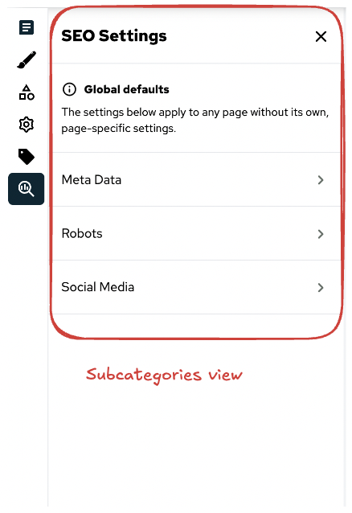
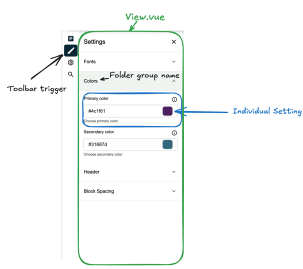

# Extensible Site‑Settings Architecture

This document explains how the settings drawer works, why the folder structure looks the way it does, and how one can plug in new settings or completely override existing ones without touching core code.

---

### Folder Layout Conventions

The folder-layout convention defines a single, predictable path for every settings component, enabling automatic discovery, clean overrides, and zero manual registration. By adhering to `settings/<mainCategory>/<subCategory>/<group>/<Setting>.vue` with `View.vue` and `ToolbarTrigger.vue`, core code, Nuxt modules, and client customisations integrate seamlessly.

|                                                              |                                            |
| ------------------------------------------------------------ | ------------------------------------------ |
|  |  |

```
components/
└─ settings/
   └─ branding-and-design/           # mainCategory ( one Toolbar button )
      ├─ View.vue                    # wrapper for the mainCategory section
      ├─ ToolbarTrigger.vue          # how the button looks in the side bar
      ├─ lang.json                   # translation file for the section
      └─ branding-and-design/        # subCategory ( intermediate section )
         ├─ 1.fonts/                 # group (order via prefix)
         │  └─ PrimaryFont.vue       # individual setting
         ├─ 2.colors/
         │  ├─ PrimaryColor.vue
         │  └─ SecondaryColor.vue
         ├─ lang.json                # translation file for the section
         └─ View.vue                 # wrapper for the subCategory section
```

> [!NOTE]
> The structure will be visually displayed if there is a valid individual setting component in the folder.

> [!NOTE]
> If there is only one subCategory, it will be automatically selected when the settings drawer is opened and groups will be displayed.

---

### View.vue

`View.vue` is a mandatory wrapper component for the mainCategory and subCategory sections. It is responsible for displaying the settings components in the correct order and structure. It also handles the section **title** and **description**.

```vue
<template>
  <SiteConfigurationView>
    <template #setting-title> SEO Settings </template>
    <template #setting-description>
      <div class="flex flex-col px-4 py-5 border-t text-sm">
        <p class="pb-2">
          <SfIconInfo size="sm" />
          <span class="px-2 align-middle font-bold">Global defaults</span>
        </p>
        <p>The settings below apply to any page without its own, page-specific settings.</p>
      </div>
    </template>
  </SiteConfigurationView>
</template>

<script setup lang="ts">
import { SfIconInfo } from '@storefront-ui/vue';
</script>
```

---

### Lang.json

This file is optional but recommended. It is used to provide translations for the folder names. These translations will be used in the settings drawer for the intermediate section name and the group names.

```json
{
  "branding-and-design": "Branding & Design"
}
```

---

### Working with Settings in modules

Any Nuxt module or customer package can replicate the same path inside `runtime/components/…/settings/**` to extend or override core files. If multiple modules try to use the same path, the first match is displayed.

Each time a new setting is plugged in, it needs to be registered manually in the runtime configuration. To register a setting inside a module, `updateRuntimeConfig` in the module's `index.ts`.

```ts
// modules/my-module/runtime/index.ts
import { defineNuxtModule, updateRuntimeConfig } from '@nuxt/kit';

export default defineNuxtModule({
  setup() {
    updateRuntimeConfig({
      public: {
        primaryColor: process.env.NUXT_PUBLIC_PRIMARY_COLOR || '#062633',
      },
    });
  },
});
```

To work with the settings in the individual components use a [Writable computed](https://vuejs.org/guide/essentials/computed#writable-computed) which overrides a setter and getter for the setting value. This allows for a clean separation of concerns and makes it easy to manage the state of each setting.

```ts
// components/settings/design/2.colors/PrimaryColor.vue
import { getPaletteFromColor, setColorProperties } from '~/utils/tailwindHelper';

const { updateSetting, getSetting } = useSiteSettings('primaryColor');

const updatePrimaryColor = (hexColor: string) => {
  const tailwindColors = getPaletteFromColor('primary', hexColor).map((color) => ({
    ...color,
  }));

  setColorProperties('primary', tailwindColors);
};

const primaryColor = computed({
  get: () => getSetting(),
  set: (value) => {
    updateSetting(value);
    updatePrimaryColor(value);
  },
});
```

---

### `useSiteSettings.ts` composable

`useSiteSettings.ts` centralises all state management for site-level settings. It exposes a minimal API - staging, reading, dirty-checking, and committing changes - so UI components can update settings without duplicating logic.

```ts
const { updateSetting, getSetting, isDirty, saveSiteSettings } = useSiteSettings('primaryColor');

updateSetting('#ff0000');
console.log(getSetting()); // → '#ff0000'
if (isDirty.value) await saveSiteSettings();
```

- **`data`** – live (unsaved) key → value map.
- **`initialData`** – snapshot of the last saved state (sourced from `useRuntimeConfig().public`).
- **`updateSetting(key, value)`** – stage a change locally.
- **`getSetting(key)`** – read the staged _or_ saved value (staged takes precedence).
- **`isDirty`** – `true` when staged data differs from saved data; useful for change notifications.
- **`saveSiteSettings()`** – commit staged data to `initialData`; long-term persistence is handled in `useSiteConfiguration.ts`.

---

### Migration guide

If you are migrating from an older version of the site settings architecture, the only breaking change is the addition of the subCategory folder. This intermediate folder will have it's own `View.vue` and `lang.json` files, which will be used to display the subCategory section in the settings drawer. If you have custom settings that do not follow this structure, you will need to update them accordingly.

For example

```
components/
└─ settings/
   └─ branding-and-design/
      ├─ 1.fonts/
      │  └─ PrimaryFont.vue
      ├─ 2.colors/
      │  ├─ PrimaryColor.vue
      │  └─ SecondaryColor.vue
      ├─ ToolbarTrigger.vue
      └─ View.vue
```

will be migrated to

```
components/
└─ settings/
   └─ branding-and-design/
      ├─ View.vue                    # wrapper for the mainCategory section
      ├─ ToolbarTrigger.vue
      └─ branding-and-design/        # subCategory ( intermediate section )
         ├─ 1.fonts/
         │  └─ PrimaryFont.vue
         ├─ 2.colors/
         │  ├─ PrimaryColor.vue
         │  └─ SecondaryColor.vue
         └─ View.vue                 # wrapper for the subCategory section
```

---

### Further Reading

- [Writable computed](https://vuejs.org/guide/essentials/computed#writable-computed)
