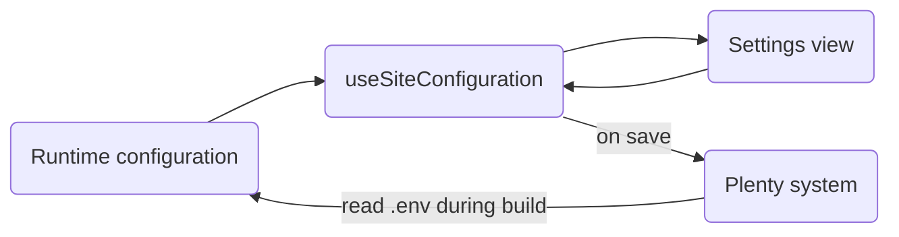

# Site settings

Developers can extend the shop editor by adding new settings that customise the storefront experience. This guide walks you through the required changes, from updating the Nuxt runtime configuration to modifying the state composable and integrating new UI elements.

## Overview



Site settings use the [Nuxt runtime configuration](https://nuxt.com/docs/guide/going-further/runtime-config).
When building the shop, the runtime configuration is populated from environment variables written in the `.env` file.
Environment variables are written in one of two ways:

- :white*check_mark: [Build via Plenty](https://knowledge.plentymarkets.com/en-gb/manual/main/online-store/shop.html#shop-build): The build pipeline reads the system database. <br />
  \*\*\_Note:*\*\* If you want to use site settings, the build via Plenty flow is recommended.
- :warning: [Build via GitHub](/guide/setup/deployment.md): The build workflow reads the repository's `CONFIG` variable. <br />
  **_Note:_** This means you have to maintain settings manually in the repository configuration. In this scenario, site settings are only useful to provide a playground.

`useSiteConfiguration` holds a [state](https://nuxt.com/docs/getting-started/state-management).
This way, it serves as the central touchpoint for settings within the editor.

- Settings views connect to it to bind user input to the app state.
- It maps the settings, so that they can be saved to the Plenty system.

The state is initialised by the runtime configuration and enables the app to react to changes made by the user in real time.
For example, the app can reflect changes to the colour palette right away.

## How to add a setting

1. In `nuxt.config.ts`, add a new property to `runtimeConfig.public`. This initialises the runtime configuration.
1. In `useSiteConfiguration/types.ts`, extend the type definition with new properties.
1. In `useSiteConfiguration.ts`, add a new data property, create an update function, and map the property when saving settings. This ensures the runtime configuration is maintained and can be persisted into the Plenty system.
1. In the settings view component, add an input that binds to the state property. This allows users to update the setting.

This section explains how to add a new setting to the shop, using the `primaryColor` setting as an example.

### Update the runtime configuration

Use `nuxt.config.ts` to register your configuration in the runtime.
When adding your property, keep the following points in mind:

- When saving the setting in Plenty, the prefix `NUXT_PUBLIC_` is added automatically.
- Handle cases where the environment variable is not provided by adding a sensible default.

```ts
// apps/web/nuxt.config.ts

export default defineNuxtConfig({
  runtimeConfig: {
    public: {
      primaryColor: process.env.NUXT_PUBLIC_PRIMARY_COLOR || '#062633',
    },
  },
});
```

### Update the type definition

In this step, you update the type definitions to include your new setting. Extend the existing types by adding the new property to both the configuration and state interfaces, aligning them with your updated runtime configuration.

```ts
// apps/web/app/composables/useSiteConfiguration/types.ts

export type ConfigurationSettings = {
  primaryColor: string;
};

export interface UseSiteConfigurationState {
  primaryColor: string;
}

export interface UseSiteConfiguration {
  primaryColor: Readonly<Ref<UseSiteConfigurationState['primaryColor']>>;
}
```

### Update the site configuration composable

For every setting you want to add, you have to update the following parts in `useSiteConfiguration.ts`:

- state
- initial state to keep track of state changes
- check if state differs from initial state
- save map

```ts
// apps/web/app/composables/useSiteConfiguration/useSiteConfiguration.ts

export const useSiteConfiguration = () => {
  const state = useState('siteConfiguration', () => ({
    primaryColor: useRuntimeConfig().public.primaryColor,
    initialData: {
      primaryColor: useRuntimeConfig().public.primaryColor,
    },
  }));

  const settingsIsDirty = computed(() => {
    return state.value.primaryColor !== state.value.initialData.primaryColor;
  });

  const saveSettings = async (): Promise<boolean> => {
    const settings = [
      {
        key: 'primaryColor',
        value: state.value.primaryColor,
      },
    ];

    state.value.initialData.primaryColor = state.value.primaryColor;

    return true;
  };
};
```

The `key` in `saveSettings` determines what the environment variable will be called in the Plenty build pipeline.
On save, it gets prefixed with `NUXT_PUBLIC_` and camelCase is transformed to SCREAMING_SNAKE_CASE.
This means `primaryColor` becomes `NUXT_PUBLIC_PRIMARY_COLOR`.

#### Advanced

For some settings, you may want to react to changes the user makes to preview effects on the app in real time.
For example, the app doesn't use a single colour, but a palette of colour shades using [TailwindCSS](/guide/how-to/theme.md).
When the user changes the primary colour, the app has to generate an updated colour palette to preview how every individual shade changes.

To react to changes the user makes in the editor, use a watcher and a corresponding update function.

```ts
// apps/web/app/composables/useSiteConfiguration/useSiteConfiguration.ts

export const useSiteConfiguration = () => {
  const updatePrimaryColor: SetColorPalette = (hexColor: string) => {
    const tailwindColors: TailwindPalette = getPaletteFromColor('primary', hexColor).map((color) => ({
      ...color,
    }));

    setColorProperties('primary', tailwindColors);
  };

  watch(
    () => state.value.primaryColor,
    (newValue) => {
      updatePrimaryColor(newValue);
    },
  );
};
```

As with the properties, you have to add your function in `types`.

```ts
// apps/web/app/composables/useSiteConfiguration/types.ts

export type SetColorPalette = (hexColor: string) => void;

export interface UseSiteConfiguration {
  updatePrimaryColor: SetColorPalette;
}
```

### Update the settings drawer

To enable the user to update a setting, you have to make it accessible in the editor.
The editor keeps all app settings in various drawer view components.
Each view is a form with inputs that are tied to the state property from `useSiteConfiguration.ts`.

```vue
<!-- apps/web/app/components/DesignView/DesignView.vue -->

<template>
  <div class="site-settings-view sticky top-[52px]" data-testid="site-settings-drawer">
    <header class="flex items-center justify-between px-4 py-5 border-b">
      <div class="flex items-center text-xl font-bold">Settings</div>
      <button data-testid="design-view-close" class="!p-0" @click="closeDrawer">
        <SfIconClose />
      </button>
    </header>

    <UiAccordionItem
      v-model="colorsOpen"
      data-testid="color-section"
      summary-active-class="bg-neutral-100"
      summary-class="w-full hover:bg-neutral-100 px-4 py-5 flex justify-between items-center select-none border-b"
    >
      <template #summary>
        <h2 class="">Colors</h2>
      </template>
      <div class="py-2">
        <div class="flex justify-between mb-2">
          <UiFormLabel>Primary color</UiFormLabel>
          <SfTooltip
            label="The shop uses a primary and secondary color palette. Each palette consists of ten shades. The colors configured here serve as the base value for the respective palette. All other shades are automatically generated during the build process."
            :placement="'top'"
            :show-arrow="true"
            class="ml-2 z-10"
          >
            <SfIconInfo :size="'sm'" />
          </SfTooltip>
        </div>
        <label>
          <SfInput v-model="primaryColor" type="text" data-testid="primary-color-select">
            <template #suffix>
              <label for="primary-color" :style="{ backgroundColor: primaryColor }" class="rounded-lg cursor-pointer">
                <input id="primary-color" v-model="primaryColor" type="color" class="invisible w-8" />
              </label>
            </template>
          </SfInput>
          <span class="typography-text-xs text-neutral-700">Choose primary color</span>
        </label>
      </div>
    </UiAccordionItem>
  </div>
</template>

<script setup lang="ts">
import { SfIconClose, SfIconInfo, SfInput, SfTooltip } from '@storefront-ui/vue';

const { closeDrawer, primaryColor } = useSiteConfiguration();
const colorsOpen = ref(false);
</script>
```

For your setting, you can either extend an existing view or create your own.
If you create your own `MyNewView.vue` component, you have to register it in `SiteConfigurationDrawer.vue` and `SettingsToolbar.vue`.

```vue
<!-- apps/web/app/components/SiteConfigurationDrawer/SiteConfigurationDrawer.vue -->

<script setup lang="ts">
const getDrawerView = (view: string) => {
  if (view === 'DesignView') return resolveComponent('DesignView');
  if (view === 'MyNewView') return resolveComponent('MyNewView');
};
</script>
```

```vue
<!-- apps/web/app/components/SettingsToolbar/SettingsToolbar.vue -->

<button
  type="button"
  class="editor-button relative py-2 flex justify-center"
  :class="{
    'bg-editor-button text-white rounded-md': drawerView === 'MyNewView',
  }"
  aria-label="Open my drawer"
  data-testid="open-my-drawer"
  @click="openDrawerWithView('MyNewView')"
>
  <NuxtImg v-if="drawerView === 'MyNewView'" width="24" height="24px" :src="paintBrushWhite" />
  <NuxtImg v-else width="24" height="24px" :src="paintBrushBlack" />
</button>
```

:::tip
`paintBrushWhite` and `paintBrushBlack` are custom icons.
For further information on adding custom icons, refer to the [Custom Icon](/guide/how-to/custom-icon.md) guide.
Alternatively, you can integrate other icon components like [Nuxt Icon](https://nuxt.com/modules/icon).
:::

Finally, extend the `DrawerView` in `types.ts`.

```ts
// apps/web/app/composables/useSiteConfiguration/types.ts

export type DrawerView =
  | 'MyNewView'
  | 'SettingsView'
  | 'blocksList'
  | 'DesignView'
  | 'SeoView'
  | 'PagesView'
  | 'blocksSettings'
  | null;
```
