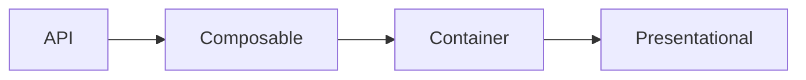

# Design guide

## Container / Presentational Pattern

[Reference](https://www.patterns.dev/vue/container-presentational/)

**Definitions**

- **Container components** are responsible for fetching and providing data.
- **Presentational components** are responsible for rendering data it receives from an outside source.
- **Composables** contain business logic, mutations, and state.

**Application**

When fetching data from the server:

- Encapsulate the API call in a composable.
Store the response data in the composable's state.

- Trigger the call in a container component.
Note that `pages` are also components.
A page is the highest-level container.
The default assumption is that a page is responsible for triggering fetch calls for data needed on that page.

- Access the data in a presentational component.
The default assumption is that presentational components use the state `data` of a composable.
Direct parent/child components may use props instead.
However, avoid props drilling, that is passing props through multiple layers.

**Example: Product page**

`useProduct` contains the `fetchProduct` method for fetching product data from the server.
The call is triggered in `pages/product/[slug]`.
Individual blocks on the page take the `data` from `useProduct` to render elements.
